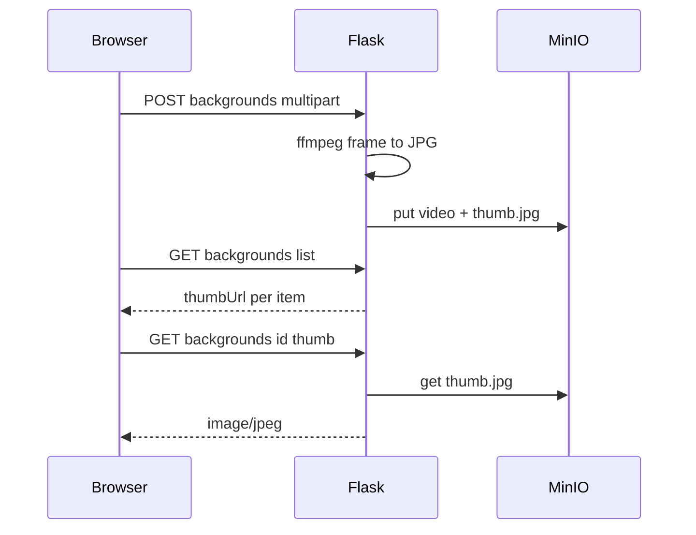

# Plan: SQLAlchemy stack, thumbnails, upload progress

## Part A — Replace database layer (Drizzle → SQLAlchemy 2.x)

### Goal

- **Single source of truth** for schema in Python: **SQLAlchemy 2.0+** declarative models and **Alembic** for migrations.
- **Remove** all Drizzle-related tooling and TypeScript schema from the repo.

### Remove / delete

- [db/schema.ts](db/schema.ts), [db/drizzle.config.ts](db/drizzle.config.ts), [db/tsconfig.json](db/tsconfig.json) (if only used for Drizzle).
- [db/package.json](db/package.json) — remove or slim to nothing if no other `db/` JS role remains (entire `db/` folder can become `alembic/` at repo root, or keep `alembic/` under `backend/` — pick one convention).
- [db/migrations/*.sql](db/migrations/) — superseded by Alembic revisions (bootstrap **initial** migration from current `0000_initial.sql` + `0001_user_backgrounds.sql` so existing deployments upgrade cleanly).

### Add

- **Dependencies** ([requirements.txt](requirements.txt)): `sqlalchemy>=2.0`, `alembic`, keep `psycopg[binary]` as the DB driver (use URL form `postgresql+psycopg://...` with SQLAlchemy).
- **Models** (e.g. `backend/models.py` or `backend/db/models.py`): map tables `users`, `user_backgrounds`, `generations` to match existing columns and indexes (see current SQL migrations).
- **Session factory** (e.g. `backend/db/session.py`): engine from `DATABASE_URL`, `sessionmaker` with sensible `expire_on_commit` for Flask request use.
- **Alembic**: `alembic.ini` + `alembic/env.py` importing the same `Base` metadata; first revision creates current schema; future changes only via new Alembic revisions.

### Port [backend/db.py](backend/db.py)

- Replace raw `psycopg` SQL with **Session**-scoped queries or SQLAlchemy 2.0 `select()` / ORM CRUD for: `create_user`, `verify_user`, `get_user_by_id`, `set_user_gallery_public`, user backgrounds CRUD, generations insert/list/get, etc.
- `**init_db()`**: call `**alembic upgrade head`** programmatically (subprocess or `command.upgrade`) **or** document `alembic upgrade` as deploy step and use `create_all` only in tests — prefer **Alembic** for production parity ([backend/migrate.py](backend/migrate.py) refactored to invoke Alembic instead of raw SQL file splitting).

### Docs / env

- Update [.env.example](.env.example) and [docs/DEVELOPMENT.md](docs/DEVELOPMENT.md), [docs/DEPLOY_DOKPLOY.md](docs/DEPLOY_DOKPLOY.md): no more “Drizzle”; point to **Alembic** and `DATABASE_URL`.

### Risks

- One-time cutover: existing DBs must match migrated schema; initial Alembic revision should mirror current SQL so `upgrade` is a no-op on already-migrated DBs (use `stamp` if needed for existing prod).

---

## Part B — Background thumbnails, lazy loading, and upload progress

### Problem

- [Maker.tsx](frontend/src/pages/Maker.tsx) uses `<video src={b.streamUrl}>` per card — heavy for large files.
- `fetch` cannot show upload progress for large multipart requests.

### 1. Server: JPEG thumbnails (S3 key convention — **no extra DB column**)

- Video: `users/{uid}/backgrounds/{uuid}.mp4`
- Thumb: `Path(video_key).with_suffix(".thumb.jpg")` (same path stem pattern as before).

Helper module (e.g. [backend/thumbnail.py](backend/thumbnail.py)):

- `thumb_key_for_video_key(video_key: str) -> str`
- `extract_video_thumbnail_jpg(video_path: Path, dest_jpg: Path)` via **ffmpeg** (`-ss 1`, `-vframes 1`, …); non-fatal on failure.

| Flow                                               | When                                                      |
| -------------------------------------------------- | --------------------------------------------------------- |
| [POST /api/backgrounds](backend/main.py)           | After video `put_file`, ffmpeg on temp file, upload thumb |
| [POST /api/generate](backend/main.py) library copy | After `put_file(ukey)`, before `rmtree(work_dir)`         |

**Routes**

- `GET /api/backgrounds/<bg_id>/thumb` — `image/jpeg` from S3 thumb key; **404** if legacy object missing.
- **DELETE** — remove both video and thumb keys from S3.
- **GET list** — add `thumbUrl` per item.

### 2. Frontend: lazy `` + fallback

- [BackgroundItem](frontend/src/api.ts): `thumbUrl?: string`
- Grid: ``; `onError` → `<video preload="none">` or placeholder.

### 3. XHR upload progress

- [frontend/src/api.ts](frontend/src/api.ts): `uploadBackgroundWithProgress`, `postGenerateWithProgress` using **XMLHttpRequest** + `xhr.upload.onprogress`, `withCredentials: true`.
- [Maker.tsx](frontend/src/pages/Maker.tsx): progress state for **library upload** and **generate** (multipart upload phase), then existing generate spinner / message for server-side processing.

---

## Suggested implementation order

1. **Part A (SQLAlchemy + Alembic + remove Drizzle)** — stabilizes all DB access before large edits in `main.py`.
2. **Part B** — thumbnails + XHR (touch same files as Part A after `db.py` port).

---

## Risks / notes (Part B)

- **ffmpeg** required in Docker (already in [Dockerfile](Dockerfile)).
- XHR must match cookie/session behavior of existing `fetch` + credentials.

