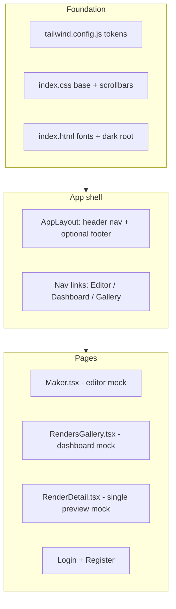

# Frontend revamp plan (Stitch / Obsidian Studio) and token efficient approach

## What we scanned

| Area          | Finding                                                                                                                                                                                                                                                                                                                                                                                                                                                                                             |
| ------------- | --------------------------------------------------------------------------------------------------------------------------------------------------------------------------------------------------------------------------------------------------------------------------------------------------------------------------------------------------------------------------------------------------------------------------------------------------------------------------------------------------- |
| Design inputs | [docs/stitch_single_video_preview/obsidian_reel/DESIGN.md](docs/stitch_single_video_preview/obsidian_reel/DESIGN.md) (tokens, typography, “no-line” surfaces), plus three static references: [single_video_preview/code.html](docs/stitch_single_video_preview/single_video_preview/code.html), [renders_dashboard/code.html](docs/stitch_single_video_preview/renders_dashboard/code.html), [reelmaker_video_editor/code.html](docs/stitch_single_video_preview/reelmaker_video_editor/code.html). |
| App stack     | **Vite + React 18 + react-router-dom + Tailwind 3** ([frontend/package.json](frontend/package.json)). [docs/DEVELOPMENT.md](docs/DEVELOPMENT.md) documents `cd frontend && bun install`. This differs from Cursor rules that mention Next.js; the revamp should target this repo as-is unless you explicitly want a Next migration (large, separate project).                                                                                                                                       |
| Routes        | [frontend/src/App.tsx](frontend/src/App.tsx): `/` Maker, `/u/:userId/renders` gallery, `/u/:userId/renders/:slug` detail, `/login`, `/register`.                                                                                                                                                                                                                                                                                                                                                    |
| Styling today | [frontend/tailwind.config.js](frontend/tailwind.config.js) has an empty `extend`; [frontend/index.html](frontend/index.html) uses `bg-white text-black`; pages use ad hoc gray/black borders (e.g. [RenderDetail.tsx](frontend/src/pages/RenderDetail.tsx), [Login.tsx](frontend/src/pages/Login.tsx)).                                                                                                                                                                                             |
| Data for UI   | [RenderMeta](frontend/src/api.ts) and [HistoryItem](frontend/src/api.ts) expose script/settings and timing; the Stitch mock shows extra labels (bitrate, “4K”, storage)—**show only fields the API provides**, and use compact “technical” rows for `renderMeta` instead of inventing fake metrics. Share URL can be `window.location.href` or `${origin}/u/${userId}/renders/${slug}`.                                                                                                             |

## Design direction (from DESIGN.md + HTML)

- **Palette**: `surface` `#0e0e0e`, primary `#b6a0ff`, secondary `#00e3fd`, tertiary `#ff96bb`, layered `surface-container`* tokens (see Stitch `tailwind.config` blocks in the HTML files).
- **Typography**: Manrope (headlines), Inter (UI/body)—load via Google Fonts in [index.html](frontend/index.html).
- **Layout rules**: Prefer **tonal separation** over heavy borders; optional `border-outline-variant/10`–style edges where needed; glass panels for floating controls (`backdrop-blur`, semi-transparent `surface-container`).
- **Icons**: Stitch uses Material Symbols. Your rules prefer **lucide-react**—recommended for this codebase (tree-shakeable, matches React) with a small icon map replacing Material usage in mockups.

## Implementation phases

### Phase 1 — Design foundation (low risk)

1. `**tailwind.config.js**`: Port `extend.colors`, `fontFamily` (`headline`, `body`, `label`), and radii from any Stitch `code.html` script block (they are consistent across the three files).
2. `**index.html**`: Set `<html class="dark" lang="en">`, remove default light body classes; add Manrope + Inter links.
3. `**index.css**`: Dark `body`/`selection` styles; replace light scrollbar rules in `.dlg-scroll` with Obsidian-style dark thumbs ([DESIGN.md](docs/stitch_single_video_preview/obsidian_reel/DESIGN.md) ghost-border / surface contrast).
4. `**main.tsx**`: Optional wrapper `className="min-h-screen bg-background text-on-surface font-body antialiased"` if not handled in layout.

### Phase 2 — Shared layout components

Add under `frontend/src/components/layout/` (names illustrative):

- `**AppHeader**`: Logo “ReelMaker”, primary nav using `NavLink` with active state (purple underline per Stitch). Links: **Editor** → `/`; **Dashboard** → `/u/:me.id/renders` when `me` exists (else hide or point to login); **Gallery** → same as dashboard or alias—**match product intent** (Stitch treats Dashboard vs Gallery as separate; here gallery *is* the user renders list—use one nav item or two labels pointing to the same route to avoid dead links).
- `**UserMenu` / status pill**: Email + avatar placeholder (initials or generic), notifications slot optional (can be omitted v1).
- `**AppFooter`**: Minimal footer like Stitch single preview (copyright, optional links)—keep thin to avoid clutter on Maker.

Wrap routes in [App.tsx](frontend/src/App.tsx) with a layout component so Login/Register can either share the same chrome or use a **simplified centered auth layout** (Stitch does not include auth pages—use same tokens).

### Phase 3 — Page revamps (priority order)

1. `**RenderDetail.tsx`** (closest to [single_video_preview/code.html](docs/stitch_single_video_preview/single_video_preview/code.html)): Breadcrumb row (“← All renders”, “Maker”), large `h1` headline, metadata line (date from `createdAt` if available on item—may need passing from list or an extra API call; if only slug route, format from existing state or extend client fetch), **9/3 grid**: main column = `<video>` in rounded `surface-container-low` with gradient overlay; optional custom control bar (can start as native `controls` inside styled container, then enhance). Sidebar: copy-link field + **Render details** cards fed from `renderMeta` (GPT/TTS models, voices, font, colors—presented as spec rows). Download: `<a href={videoSrc} download>` styled as primary button.
2. `**RendersGallery.tsx`** ( [renders_dashboard/code.html](docs/stitch_single_video_preview/renders_dashboard/code.html) ): Card grid with thumbnails if available, topic title, elapsed time, link to detail; owner toggle for public gallery in a **panel** surface, not a heavy border.
3. `**Maker.tsx`** (largest file; [reelmaker_video_editor/code.html](docs/stitch_single_video_preview/reelmaker_video_editor/code.html)): Re-skin in place—group sections into **surface panels** (topic/script, voices, render options, background library), preserve all existing handlers and API calls. Use existing `BgPreview`, `DialogueEditor` but update **classNames** to token-based styles; add `custom-scrollbar` class for dialogue area consistent with DESIGN.md.
4. `**Login.tsx` / `Register.tsx`**: Dark card layout, primary CTA button, inputs using `surface-container-lowest` + focus ring `primary` per spec.

### Phase 4 — Polish and consistency

- **Buttons / inputs**: Either small local components (`PrimaryButton`, `GhostButton`, `Field`) in `components/ui/` **or** add shadcn-style primitives later—pure Tailwind components are enough for v1 and mirror Stitch closely.
- **Accessibility**: Preserve labels, focus states, `aria-busy` on loading buttons; ensure contrast on `on-surface-variant` body text.
- **Verify**: `cd frontend && bun run build` (per [DEVELOPMENT.md](docs/DEVELOPMENT.md)); fix any TS/CSS issues.

## Out of scope (unless you ask)

- Migrating from Vite to Next.js App Router.
- Backend changes to supply bitrate/duration unless already available—UI should degrade gracefully.
- `npx prisma db push` / DB operations (not applicable to this frontend-only revamp).

## Key files to touch

- [frontend/tailwind.config.js](frontend/tailwind.config.js), [frontend/index.html](frontend/index.html), [frontend/src/index.css](frontend/src/index.css)
- New: `frontend/src/components/layout/`*, optional `frontend/src/components/ui/`*
- [frontend/src/App.tsx](frontend/src/App.tsx) — layout wrapper
- [frontend/src/pages/Maker.tsx](frontend/src/pages/Maker.tsx), [RenderDetail.tsx](frontend/src/pages/RenderDetail.tsx), [RendersGallery.tsx](frontend/src/pages/RendersGallery.tsx), [Login.tsx](frontend/src/pages/Login.tsx), [Register.tsx](frontend/src/pages/Register.tsx)
- [frontend/package.json](frontend/package.json) — add `lucide-react` (and `clsx` + `tailwind-merge` only if you want shadcn later)

