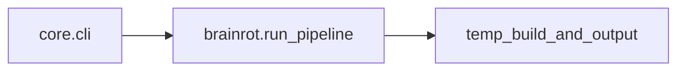

# Architecture (CLI-only)

## Overview

- **`core/brainrot.py`** — dialogue, TTS, FFmpeg; writes under `temp_build/` and your `--output` path.
- **`core/cli.py`** — argparse entry; loads `.env` and calls `run_pipeline`.

There is no database, object storage, or web API in this repository.
